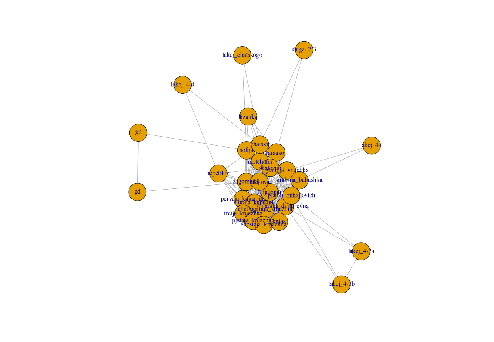
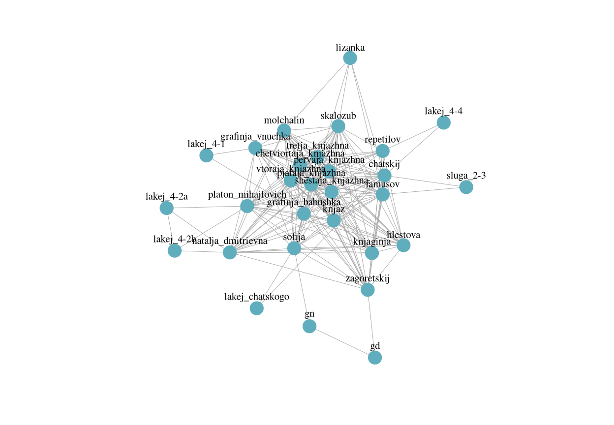

workshop
================
Евгения Устинова
13/10/2019

## Подготовка окружения.

Для начала, установим необходимые для работы библиотеки. Строку
показанную ниже нужно выполнить в консоли.

``` r
#install.packages("jsonlite", "httr", "igraph", "parallel", "ggplot2")
```

Подключим эти библиотеки:

``` r
library("jsonlite")
library("httr")
library("igraph")
library("ggplot2")
library("parallel")
```

## Подготовка данных

Попробуем скачать данные для одной пьесы, например для “Горя от ума”.

``` r
play_csv <- read.csv("https://dracor.org/api/corpora/rus/play/griboyedov-gore-ot-uma/networkdata/csv", stringsAsFactors = F)
```

Сеть записана в виде списка рёбер:

| Source  | Type       | Target    | Weight |
| :------ | :--------- | :-------- | -----: |
| lizanka | Undirected | sofija    |     13 |
| lizanka | Undirected | famusov   |      2 |
| lizanka | Undirected | molchalin |      4 |
| lizanka | Undirected | chatskij  |      6 |
| lizanka | Undirected | skalozub  |      1 |
| sofija  | Undirected | famusov   |      4 |

Теперь из этой таблицы попробуем построить сеть.

Удалим переменную Type - она одинаковая для всех графов и не нужна для
построения графа.

``` r
play_csv$Type <- NULL
```

``` r
play_graph <- graph_from_data_frame(play_csv, directed = F)
play_graph <- set_edge_attr(play_graph, "weight", value = play_csv$Weight)
play_graph
```

    ## IGRAPH c9055f5 UNW- 29 203 -- 
    ## + attr: name (v/c), Weight (e/n), weight (e/n)
    ## + edges from c9055f5 (vertex names):
    ##  [1] lizanka--sofija             lizanka--famusov           
    ##  [3] lizanka--molchalin          lizanka--chatskij          
    ##  [5] lizanka--skalozub           sofija --famusov           
    ##  [7] sofija --molchalin          sofija --chatskij          
    ##  [9] sofija --skalozub           sofija --grafinja_vnuchka  
    ## [11] sofija --zagoretskij        sofija --platon_mihajlovich
    ## [13] sofija --hlestova           sofija --gn                
    ## [15] sofija --natalja_dmitrievna sofija --grafinja_babushka 
    ## + ... omitted several edges

``` r
plot(play_graph)
```

<!-- -->

Если немного поразбираться, то и с помощью `igraph` можно создать
более-менее симпатичную визуализацию.
<!-- -->

Загрузим файлы со списком рёбер в RStudio. Для этого нам понадобится сам
список пьес.

``` r
list_of_names <- fromJSON("https://dracor.org/api/corpora/rus")

sorted_names <- list_of_names$dramas$name[sort.list(list_of_names$dramas$name)]
```

``` r
plays <- lapply(sorted_names, function(x) read.csv(paste0("https://dracor.org/api/corpora/rus/play/", x, "/networkdata/csv"), stringsAsFactors = F))
```

Снова удалим переменную Type, но теперь уже для этого надо самим
написать функцию, чтобы использовать её для всех пьес сразу.

``` r
del_vars <- function(play){
  play$Type <- NULL
  return (play)
}
plays <- lapply(plays, del_vars)
```

Загрузим метаданные

``` r
metadata <- read.csv(paste0("https://dracor.org/api/corpora/", corpusname, "/metadata.csv"),
                     stringsAsFactors = F)
metadata <- metadata[order(metadata$name),]
```

| name                | id        | yearNormalized | size | genre   | averageClustering |   density | averagePathLength | maxDegreeIds             | averageDegree | diameter | yearPremiered | yearPrinted | maxDegree | numOfSpeakers | numConnectedComponents | yearWritten | numOfSegments | wikipediaLinkCount | numOfActs |
| :------------------ | :-------- | -------------: | ---: | :------ | ----------------: | --------: | ----------------: | :----------------------- | ------------: | -------: | ------------: | ----------: | --------: | ------------: | ---------------------: | ----------: | ------------: | -----------------: | --------: |
| afinogenov-mashenka | rus000167 |           1941 |   12 |         |         0.9599327 | 0.9545455 |          1.045454 | several characters       |     10.500000 |        2 |          1941 |        1941 |        11 |            12 |                      1 |        1940 |             7 |                  1 |         3 |
| andreyev-k-zvezdam  | rus000194 |           1906 |   13 |         |         0.9580420 | 0.9487179 |          1.051282 | several characters       |     11.384615 |        2 |          1906 |          NA |        12 |            13 |                      1 |        1905 |             4 |                  0 |         4 |
| andreyev-mysl       | rus000137 |           1914 |   15 | tragedy |         0.8108995 | 0.3714286 |          1.914286 | kerzhentsev              |      5.200000 |        3 |          1914 |        1914 |         9 |            15 |                      1 |        1913 |             6 |                  0 |         3 |
| andreyev-ne-ubiy    | rus000138 |           1913 |   23 |         |         0.9121040 | 0.5889328 |          1.415020 | vasilisa\_petrovna|yakov |     12.956522 |        3 |          1913 |        1913 |        21 |            23 |                      1 |        1913 |             6 |                  0 |         5 |
| babel-marija        | rus000119 |           1935 |   22 |         |         0.8762715 | 0.3203463 |          1.909091 | katya                    |      6.727273 |        3 |          1964 |        1935 |        14 |            22 |                      1 |        1934 |             8 |                  2 |         0 |
| babel-zakat         | rus000118 |           1927 |   37 |         |         0.8985211 | 0.3918919 |          1.674174 | mendel                   |     14.108108 |        3 |          1927 |        1928 |        32 |            37 |                      1 |          NA |             8 |                  3 |         0 |

Создадим большой список, со всеми сетями

``` r
graphs_of_plays <- mclapply(plays, function(x) graph_from_data_frame(x, directed = F))
```
